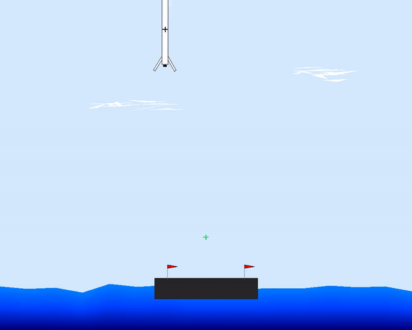
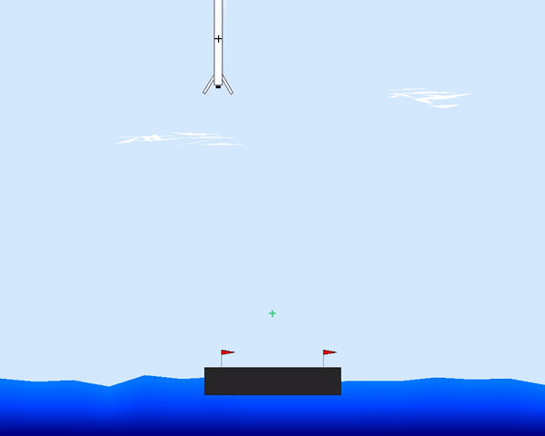

# rocket-lander

This repository has been created for the project of the master course "Computational Control" with <a href="https://www.bsaver.io/">Dr. Saverio Bolognani</a>. The project is a simulation of the SpaceX Falcon 9 vertical landing phase its purpose is to develop a controller to land the rocket.

## System

  

### States
 $$\textbf{x}=\begin{bmatrix}
x & y & \dot{x} & \dot{y} & \theta  & \dot{\theta } & c_{L} & c_{R} \\
\end{bmatrix}$$
- $`(x,y)`$: the 2D position of the rocket center of mass [m]
- $`(\dot{x},\dot{y})`$: the velocity of the rocket [m/s]
- $`\theta`$: the angle of the rocket [rad]
- $`\dot{\theta }`$: the angular velocity of the rocket [rad/s]
- $`c_{L}, c_{R}`$: binary variables indicating wether the left or right legs are in contact with the environment, respectively (equal to 0 otherwise)

### Inputs
 $$\textbf{u}=\begin{bmatrix}
F_{E} & F_{S} & \phi \\
\end{bmatrix}$$
- $`F_{E}`$: the thrust produced by the main engine in Newtons, acting directly on the rocket body at the point where the nozzle pivots
- $`F_{S}`$: the thrust produced by the side gas thrusters in Newtons, defined as the difference  $`F_{L}-F_{R}`$, acting at a distance $`l_{2}`$ from the rocket center of mass
- $`\phi`$: the angle of the nozzle with respect to the rocket body in radians, which changes the direction of $`F_{E}`$. It can be discontinuous and it has instant response up to the 60 fps frame rate of our model

## Controller
Even though a PID controller works well under "easy" initial states, it fails for more complex scenarios. Therefore, I chose to use a tracking MPC for the following reasons:
* **Constraints handling**: the incorporation of the constraints during the design of the MPC provides a safe operation of the rocket within its boundaries
* **Trajectory optimization**: the fact that the MPC optimizes the trajectory over a finite time horizon at each time step results in smoother and more accurate tracking
* **Nonlinear System Handling**: even though the tracking MPC uses a linear model of the rocket, it is still more robust to nonlinearities than the PID controller
 
<h3 align="center">PID &emsp; &emsp; &emsp; &emsp; &emsp; &emsp; &emsp; &emsp; &emsp; &emsp; &emsp; &emsp; &emsp; &emsp; MPC</h3>

    
    

